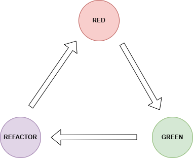

# QA TDD Mocha JavaScript

## Desafio Técnico TDD/BDD

Este é um projeto completo seguindo os princípios do TDD para implementar os requisitos funcionais solicitados. Os testes verificam tanto os casos especificados nos requisitos quanto alguns casos de borda importantes. A implementação segue estritamente o resultado dos testes, conforme preconizado pelo TDD.

### 1. Quais são as duas regras principais do TDD?

As duas regras principais do TDD são:
- Escrever um teste antes de escrever o código funcional, ou seja, não escrevemos código de produção até ter escrito um teste que falhe (e ele falhará justamente porque a funcionalidade ainda não foi implementada).
- Escrever apenas o código necessário para que o teste passse, ou seja, você não deve escrever mais do que o necessário e não compilar é falhar.

### 2. Com base nas duas regras do TDD, qual é a ordem correta para a execução das tarefas durante o ciclo de desenvolvimento no TDD?

1°: Escrever um teste que falha (Red)

2°: Escrever o mínimo de código necessário para que o teste passe (Green)

3°: Refatorar o código de modo que a qualidade melhore, mas o comportamento permaneça o mesmo (Refactor)

<div style="text-align:center">
  
</div>

### 3. Quais são as três leis do TDD?

- Não escrever código de produção antes de escrever um teste que falhará, uma vez que o desenvolvimento sempre se inicia com um teste.
- Não escrever mais código de teste do que o necessário para falhar.
- Não escrever mais código de produção do que o necessário para que o teste passe, evitando funcionalidades extras.

## Técnica de teste utilizada

Para este projeto, utilizei a técnica de **Análise de Valores Limite (Boundary Value Analysis)** para levantar os casos de teste. Esta técnica foi escolhida porque:

1. Os requisitos estabelecem um limite de idade (17 anos) que separa os comportamentos esperados.
2. Testar os valores nas fronteiras (17 e 18 anos) é essencial para garantir que o sistema funcione conforme especificado.
3. Além dos valores limite, incluí também casos dentro dos intervalos (16 e 25 anos) para confirmar o comportamento em valores não fronteiriços.
4. Adicionei casos de validação para entrada inválida (idade negativa e não numérica) para tornar o sistema mais robusto.

Esta abordagem garante que testamos não apenas o comportamento funcional esperado, mas também casos de borda e validações necessárias para um código de produção confiável.

## Requisitos do projeto

[](https://nodejs.org/docs/latest/api/)
[](https://docs.npmjs.com/)
[](https://mochajs.org/)
[](https://www.chaijs.com/)
- Node.js (versão 12 ou superior)

- npm (gerenciador de pacotes do Node.js)


> Necessário realizar o download somente no NodeJS. As demais dependências são instaladas via npm, como veremos a seguir.

## Como instalar e executar o projeto

1. Clone o repositório:


```bash
git clone https://github.com/enokjanuario/qa.tdd-mocha.javascript.git   
```
```bash
cd qa.tdd-mocha.javascript
```
2. Instale as dependências:
```bash
npm install
```
3. Execute os testes:
```bash
npm test
```

## Estrutura do projeto

- `src/pessoa.js`: Contém a implementação da classe Pessoa com o método ehMaiorDeIdade.
- `test/pessoa.test.js`: Contém os testes unitários implementados com Mocha e Chai.

